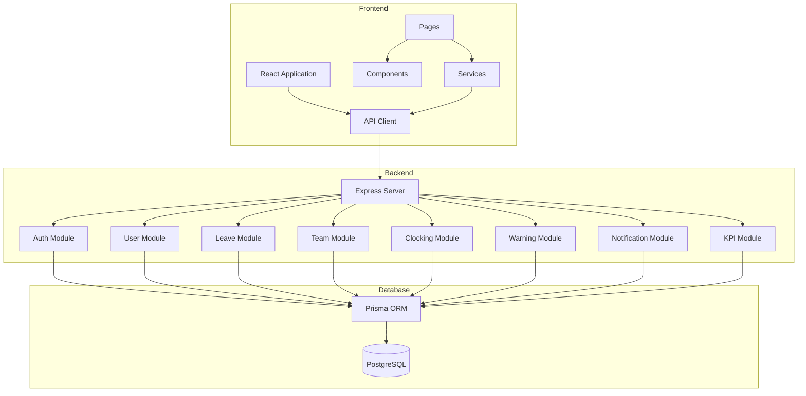
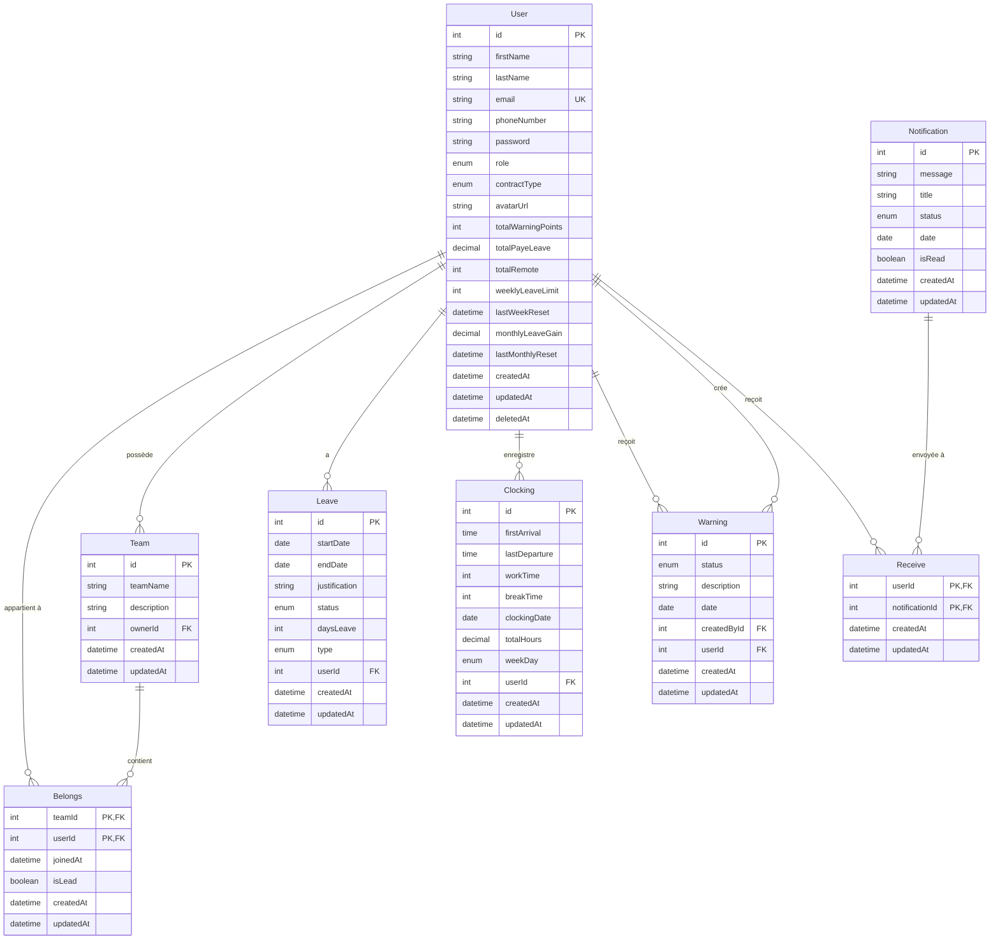
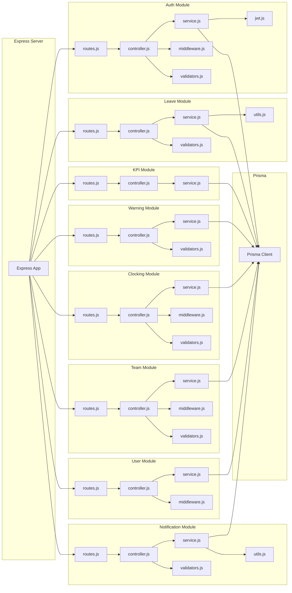
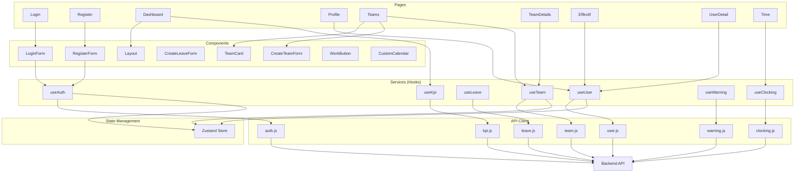
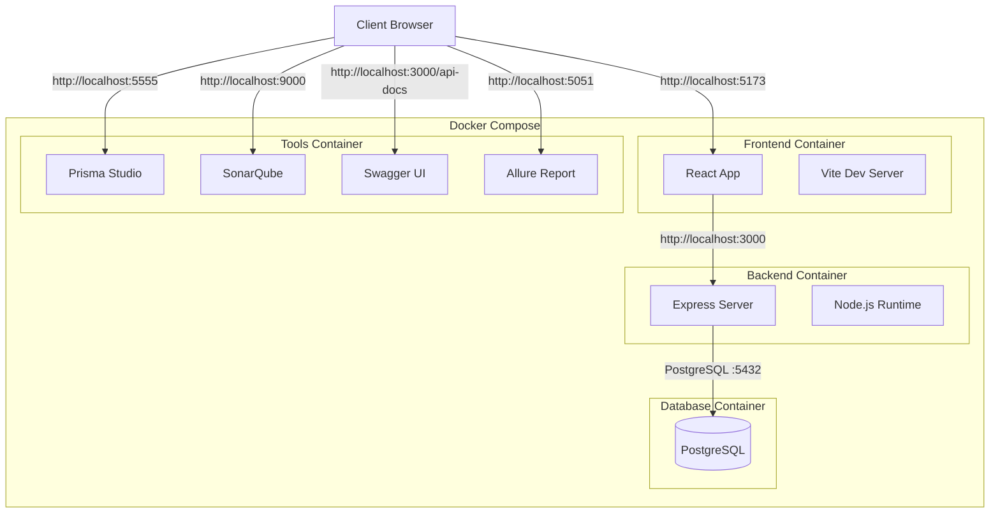

# Schéma UML du Projet

Ce document contient les schémas UML du projet de gestion de temps et de ressources humaines.

## Visualisation

### PlantUML (Recommandé)
Le fichier `schema-uml.puml` contient plusieurs diagrammes PlantUML que vous pouvez visualiser avec :
- [PlantUML Online](http://www.plantuml.com/plantuml/uml/)
- Extension VS Code : "PlantUML"
- Extension IntelliJ/WebStorm : "PlantUML integration"

### Mermaid (Alternative)
Les diagrammes ci-dessous utilisent la syntaxe Mermaid, compatible avec GitHub et la plupart des éditeurs Markdown.

---

## 1. Architecture Générale

---

## 2. Modèles de Données (Diagramme de Classes)

---

## 3. Modules Backend

---

## 4. Architecture Frontend

---

## 5. Déploiement

---

## Technologies Utilisées

### Backend
- **Node.js** : Runtime JavaScript
- **Express** : Framework web
- **PostgreSQL** : Base de données relationnelle
- **Prisma** : ORM pour PostgreSQL
- **JWT** : Authentification par tokens
- **Zod** : Validation de schémas
- **Swagger** : Documentation API

### Frontend
- **React** : Bibliothèque UI
- **Vite** : Build tool et dev server
- **Ant Design** : Composants UI
- **React Router** : Routage
- **Zustand** : Gestion d'état
- **React Query** : Gestion des données serveur
- **Recharts** : Graphiques

### Infrastructure
- **Docker** : Containerisation
- **Docker Compose** : Orchestration
- **SonarQube** : Analyse de code
- **Vitest** : Framework de tests
- **Allure** : Rapports de tests

---

## Enums

### Role
- `Employer` : Employé
- `Manager` : Manager
- `Responsable` : Responsable

### ContractType
- `H15` : 15 heures/semaine
- `H35` : 35 heures/semaine
- `H40` : 40 heures/semaine

### LeaveStatus
- `Pending` : En attente
- `Approved` : Approuvé
- `Refused` : Refusé

### LeaveType
- `Absence` : Absence
- `PaidLeave` : Congé payé
- `Training` : Formation
- `Remote` : Télétravail

### WarningStatus
- `Alert` : Alerte
- `Late` : Retard
- `UnjustifiedAbsence` : Absence injustifiée

### NotificationStatus
- `Present` : Présent
- `Late` : Retard
- `Warning` : Avertissement

### WeekDay
- `Monday` à `Sunday` : Jours de la semaine

